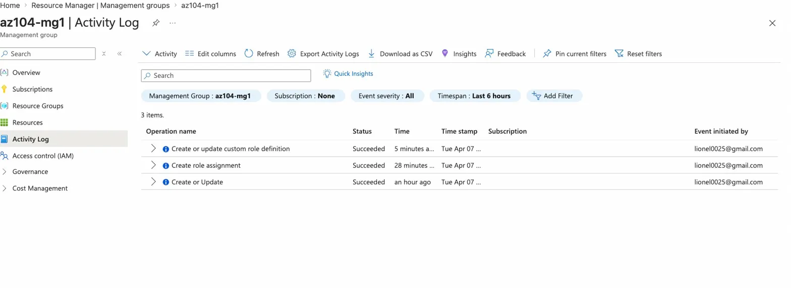

# Lab 1 - Manage Subscriptions and RBAC

## What This Lab Was About

This lab was about controlling who can do what in Azure. The scenario was a help desk team that needed to manage virtual machines and create support tickets, but nothing beyond that. In Azure this is handled through something called RBAC, which stands for Role-Based Access Control. Think of it like giving someone a key card that only opens certain rooms.

## What I Did

I started by creating a management group called `az104-mg1`. A management group sits above your subscriptions in Azure, kind of like a folder that holds everything. The reason I used one is so I could assign permissions once at the top and have them flow down to all the subscriptions underneath automatically.

From there I assigned the **Virtual Machine Contributor** role to the help desk team at the management group level. That role gives them everything they need to manage VMs without touching anything else in the environment.

The built-in roles did not fit exactly what I needed so I created a custom one. I based it on the **Support Request Contributor** role but removed one specific permission called `Microsoft.Support/register/action`. That permission lets someone register new Azure resource providers, which is more of an admin task that the help desk should not be doing. Removing it keeps their access limited to just what the job requires.

```json
{
  "actions": ["Microsoft.Support/*"],
  "notActions": ["Microsoft.Support/register/action"],
  "assignableScopes": [
    "/providers/Microsoft.Management/managementGroups/az104-mg1"
  ]
}
```

After setting everything up I checked the Activity Log to confirm Azure recorded all three actions. The management group creation, the role assignment, and the custom role definition all showed up. Being able to verify that in a log matters in a real environment because you need a paper trail showing who changed what and when.

## Screenshots

| What It Shows | Screenshot |
|---|---|
| Role assignments on az104-mg1 |  |
| Activity log showing all three operations |  |

## What I Learned

Management groups let you set permissions one time and have them apply across multiple subscriptions automatically. RBAC in Azure stacks permissions, so a person gets access based on everything their roles allow combined. The `notActions` field lets you remove one specific thing without blocking everything else. The Activity Log records every action taken in Azure so you can always trace back what happened.

## Skills

`Azure RBAC` `Management Groups` `Custom Role Definitions` `Least Privilege` `Activity Log` `Microsoft Entra ID`
