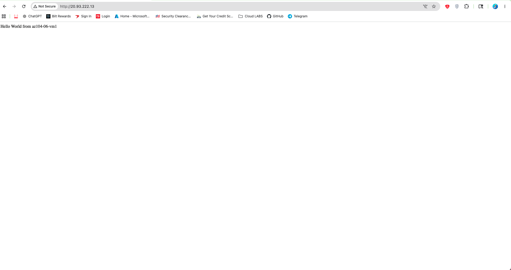
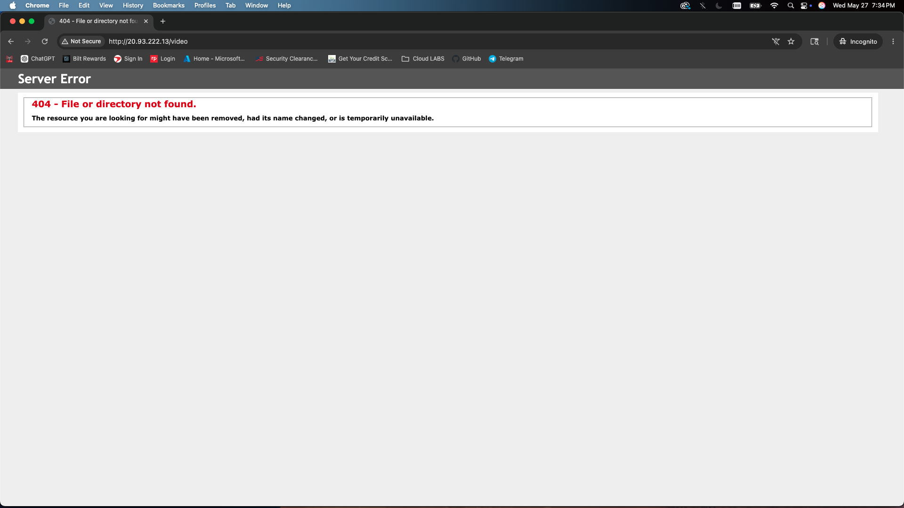
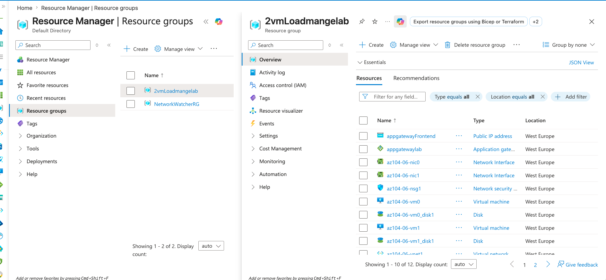
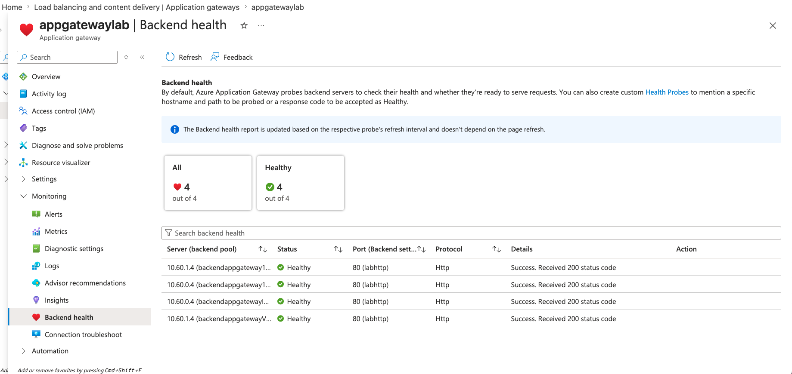

# Lab 4 - Implement Network Traffic Management

## What This Lab Was About

This lab was about making sure traffic gets spread across multiple servers instead of hitting just one. If only one server handles everything and it crashes, the whole thing goes down. The fix is to put something in front of the servers that splits the traffic and keeps an eye on which servers are still running. This lab covered two Azure tools that do that: Azure Load Balancer and Azure Application Gateway.

Note: The official lab uses three VMs. I did it with two because of free trial limits. Everything still works the same way.

## The Infrastructure I Built

I set up a virtual network and split it into subnets, one section for the load balancer, one for the application gateway, and one for the VMs themselves. Keeping them in separate sections just keeps things organized and clean.

I deployed two virtual machines with web servers on them to act as the backend.

## Azure Load Balancer

The Load Balancer sits in front of the two VMs and splits incoming traffic between them. It does not look inside the requests, it just knows where traffic is coming from and sends it to the next available server.

I set up a **backend pool** with both VMs in it. All traffic going to the load balancer's IP gets split across that pool.

The **health probe** is what makes it smart. It checks each VM on a timer. If one stops responding, the load balancer stops sending it traffic automatically. When it comes back, it starts getting traffic again. No one has to do anything manually.

**Load balancing rules** connect the public IP to the backend pool and tell it which port to use.

## Azure Application Gateway

The Application Gateway does the same job but smarter. It actually reads the request, so it can make decisions based on what the user is asking for.

I configured:

- A **frontend IP** that takes in the web traffic
- A **backend pool** with the VMs
- **HTTP settings** for how it talks to the backend
- A **listener** that watches for incoming requests
- **Routing rules** that connect the listener to the backend pool

It also comes with a built-in firewall called WAF that can block common attacks. I did not turn it on for this lab but it is there.

## How Traffic Distribution Works

With the Load Balancer, traffic goes back and forth between servers. First request goes to VM1, second goes to VM2, third goes back to VM1, and so on.

With the Application Gateway you can get more specific. You can send requests to `/videos` to one set of servers and `/images` to a completely different set, all based on the URL path.

## Architecture

```
Internet
    │
    ▼
Azure Load Balancer (Layer 4 - TCP/UDP)
    │
    ├── VM1 (web server)
    └── VM2 (web server)

Internet
    │
    ▼
Azure Application Gateway (Layer 7 - HTTP/HTTPS)
    │
    ├── VM1 (web server)
    └── VM2 (web server)
```

## What I Learned

The Load Balancer is simple and fast but it cannot look inside requests. The Application Gateway costs more but lets you route based on what the request actually contains. Health probes are what make both tools reliable because they automatically stop sending traffic to a broken server without anyone needing to step in.

## Screenshots

| What It Shows | Screenshot |
|---------------|------------|
| Load Balancer frontend IP responding and routing traffic to az104-06-vm1 |  |
| Application Gateway path-based routing test — `/image` path hit the backend |  |
| Application Gateway path-based routing test — `/video` path hit the backend |  |
| Resource group showing all lab resources (VMs, App Gateway, Load Balancer) |  |
| Application Gateway backend health — all backends showing Healthy |  |

## Skills

`Azure Load Balancer` `Azure Application Gateway` `Backend Pools` `Health Probes` `Load Balancing Rules` `Layer 4 vs Layer 7` `Traffic Distribution` `Virtual Networks` `Azure Portal`
